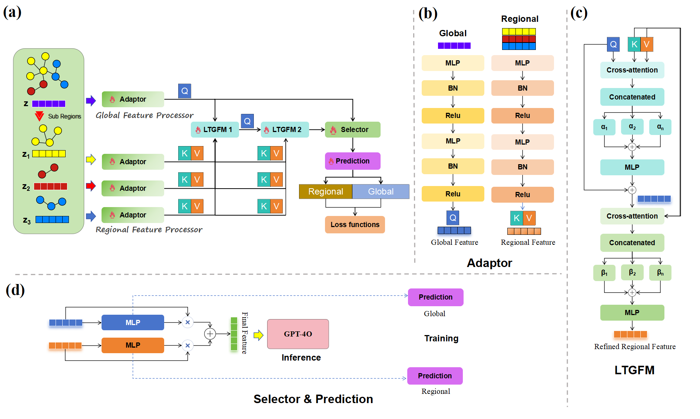
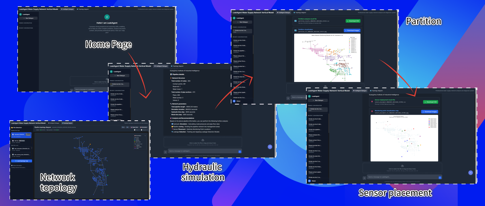
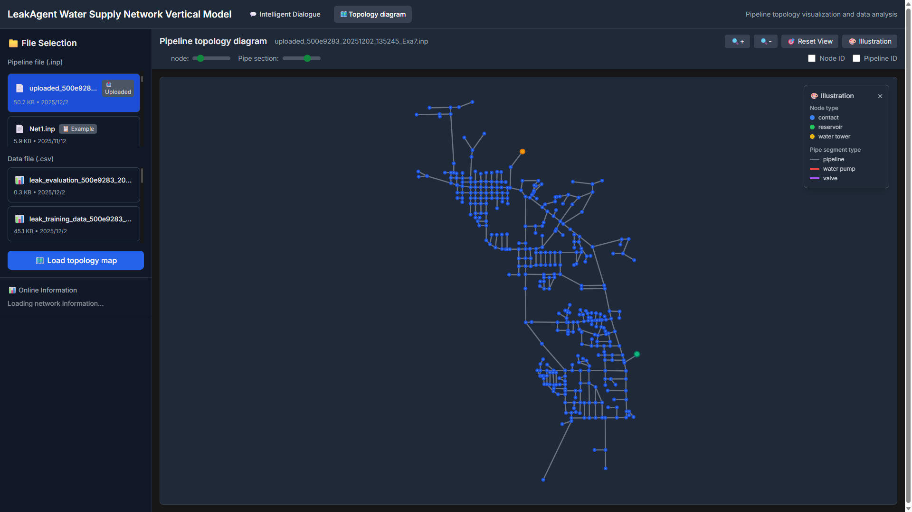

<div align="left">

# LeakAgent: Multi-Agent Coordination for Water Distribution Networks

**An Intelligent System for Leak Detection, Localization, and Sensor Placement via Multi-Modal LLMs**

[Tianwei Mu](https://github.com/mutianwei521)</sup>

Guangzhou Institute of Industrial Intelligence

[](https://drive.google.com/file/d/1oZm9E2qCikHOpMeODedFsH2RQZxJ4bw8/view?usp=drive_link)
[](https://www.python.org/downloads/release/python-3100/)
[](https://opensource.org/licenses/MIT)

</div>

---
## 🔥 News
- **[2026-02-11]** Released leak detection module. Fixed device mismatch bugs and optimized leak detection moudule.
- **[2026-02-09]** LeakAgent code is released! Now supports advanced sensor placement and boundary optimization.
- **[2026-01-20]** Added support for spectral clustering-based network partitioning.

## 📋 Introduction

**LeakAgent** is a comprehensive multi-agent system designed to revolutionize water distribution network (WDN) management. By leveraging the power of Multi-modal Large Language Models (LLMs), it acts as an intelligent, interactive assistant for hydraulic engineers and researchers.

The system orchestrates a team of specialized agents to execute complex, multi-step tasks across the WDN lifecycle:

- 💧 **Hydraulic Analysis**: Precision simulation of pressure, flow, and head using EPANET.
- 🧩 **Network Partitioning**: Intelligent division of large networks into manageable optimization zones.
- 📡 **Sensor Placement**: Strategic optimization of sensor locations for maximum coverage and resilience.
- 🔍 **Leak Detection & Localization**: Advanced machine learning models to identify and pinpoint leaks in real-time.
- 📊 **Interactive Visualization**: Intuitive web-based interface for topology analysis and result interpretation.

## 🏗️ Architecture


*Figure 1: The architecture of LeakDetection Agent: (a) Total workflow for training; (b) Adaptor layer; (c) LTGFM layers; (d) Inference of LeakDetection Agent.*

## 🚀 Quick Start

### Prerequisites
- **OS**: Windows 10/11, Linux, macOS
- **Python**: 3.8–3.11 (Recommended: 3.11)
- **Hardware**: NVIDIA GPU (8GB+ VRAM recommended for training), 16GB+ RAM

### Installation & Run

1.  **Clone the repository**
    ```bash
    git clone https://github.com/mutianwei521/leakagent.git
    cd leakagent
    ```

2.  **Configure Environment**
    
    LeakAgent requires an OpenAI API Key to power its multi-modal agents.
    
    - Copy the example configuration file:
      ```bash
      cp .env.example .env
      # On Windows: copy .env.example .env
      ```
    - Open `.env` and add your API keys:
      ```properties
      OPENAI_API_KEY=sk-your_openai_key_here
      SERPAPI_API_KEY=your_serpapi_key_here  # Optional
      ```

3.  **Start the system**
    ```bash
    ./start.sh   # Linux/Mac
    start.bat    # Windows
    ```
    Or manually:
    ```bash
    pip install -r requirements.txt
    python app.py
    ```

3.  **Access the interface**
    Open your browser and navigate to: [http://localhost:5000](http://localhost:5000)

## 📊 Interface & Demo

<div align="center">
  
</div>
<p align="center"><em>Figure 2: The interactive web interface of LeakAgent.</em></p>

### 🎥 Demo Video
[](https://www.youtube.com/watch?v=GbUHKllEPh0)
*Click the image above to watch the demonstration video.*

## 💡 Recommended Prompts

LeakAgent understands natural language. Here are effective prompts to get you started:

### 1. 🧩 Network Partitioning
> "Please partition the network into 5 zones."
> "Divide the network using spectral clustering algorithm."
> "Perform graph partitioning analysis on this network."

### 2. ⚙️ Optimization
> "Optimize the network partition to minimize cut edges."
> "Optimize sensor placement for maximum detection coverage."
> "Find the optimal configuration for pressure monitoring."

### 3. 📡 Sensor Placement
> "Where should I place 3 pressure sensors? "
> "Recommend the best locations for monitoring sensors."
> "Analyze sensor placement resilience."

### 4. 🔍 Leakage Model
> "Train a leak detection model with 100 epochs."
> "Build a leak identification model using 50 scenarios."
> "Detect leaks based on the current sensor data."

### 5. ℹ️ Network Information
> "Show me the network summary."
> "What is the total pipe length?"
> "Analyze the network structure."
> "How many junctions and reservoirs are there?"

## 📂 Project Structure

```
leakagent/
├── app.py                  # Main Flask application
├── mm_wds_agent.py         # Multi-modal agent coordination logic
├── wds_leak_main.py        # Leak detection module (Training & Inference)
├── wds_partition_main.py   # Network partitioning module
├── wds_sensor_main.py      # Sensor placer module
├── LTFM-WaterNetwork/      # Deep learning models (Graph2Vec, LTFM)
│   ├── src/models/         # Model architectures
│   └── src/training/       # Training pipelines
├── optimization_utils/     # Optimization algorithms (NSGA-II)
├── partition_utils/        # Partitioning algorithms (Louvain, FCM)
├── templates/              # HTML templates for web interface
├── static/                 # CSS, JS, and static assets
├── dataset/                # WNTR network files (.inp)
├── .env.example            # Environment variables template
└── requirements.txt        # Python dependencies
```

## 📂 Resources

**Original INP Files**:
- [Net1 (Google Drive)](https://drive.google.com/file/d/1oZm9E2qCikHOpMeODedFsH2RQZxJ4bw8/view?usp=drive_link)
- [KY3 (Google Drive)](https://drive.google.com/file/d/10kc7K7lo8v8gk9d-AlB32B9rIbox5bKC/view?usp=drive_link)
- [KY5 (Google Drive)](https://drive.google.com/file/d/17_DD-6aCh1UazxIIz9ifML3Dzi4z5y6p/view?usp=drive_link)

## 📜 Acknowledgments

The authors express deep gratitude to **Dr. Enyang Gao**, General Manager of Deep-Sea 3D Vision Co., Ltd., whose invaluable guidance and mentorship made this research possible. The project serves as a tribute to Dr. Gao’s contributions to the field of computer science and his continued support of our research endeavors.

Benchmarks are derived from the [OpenWaterAnalytics EPANET-Matlab-Toolkit](https://github.com/OpenWaterAnalytics/EPANET-Matlab-Toolkit).

## 📝 Citation

As soon as possible

## 📄 License

This project is licensed under the [MIT License](LICENSE).
